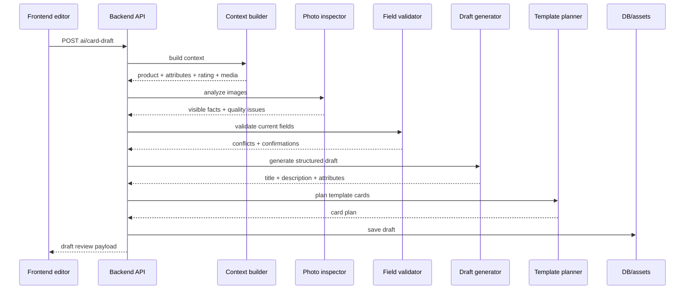

# AI layer for product card completion and visual templates

Дата: 2026-05-30

## Цель

Спроектировать AI-слой, который помогает продавцу довести карточку товара до высокого контент-рейтинга:

- анализирует фото товара;
- учитывает пользовательский промт;
- позволяет приложить визуальный референс или выбрать готовый;
- определяет, что изображено, и извлекает видимые свойства;
- проверяет уже заполненные пользователем параметры;
- предлагает заполнение недостающих полей;
- объясняет, какие значения требуют подтверждения;
- формирует стильные изображения карточки по выбранным шаблонам;
- готовит безопасный черновик для применения в Ozon без автопубликации спорных данных.

## Текущая база в проекте

Уже есть:

- `marketplace_products` с `image_urls`, `video_urls`, `payload`.
- Синхронизация Ozon: список товаров, детальная информация, атрибуты.
- Получение обязательных атрибутов Ozon и значений справочников.
- Обновление и хранение `payload.content_rating`.
- UI-мастер редактирования карточки: информация, характеристики, медиа, preview.
- Сохранение медиа в Ozon.
- Создание новой позиции Ozon.

Чего нет:

- вызова AI-моделей;
- отдельного AI-сервиса для карточек;
- структурированного черновика AI-предложений;
- проверки пользовательских значений по фото и справочникам;
- шаблонного генератора инфографики/изображений карточки;
- полноценного update endpoint для параметров существующей карточки.

## Ключевой пользовательский сценарий

1. Пользователь открывает товар с низким контент-рейтингом.
2. Нажимает `Заполнить с ИИ`.
3. Система собирает контекст: фото, текущие поля, Ozon payload, атрибуты категории, справочники, контент-рейтинг.
4. AI анализирует фото и определяет товар, видимые параметры и ограничения.
5. AI проверяет уже заполненные поля пользователя:
   - совпадает ли название с товаром на фото;
   - не конфликтуют ли цвет, материал, комплектация, модель;
   - достаточно ли описание отражает товар;
   - какие поля нельзя подтвердить по фото.
6. AI предлагает черновик заполнения:
   - название;
   - описание;
   - аннотация;
   - хештеги;
   - атрибуты Ozon;
   - рекомендации по медиа;
   - список конфликтов и вопросов пользователю.
7. Пользователь вводит дополнительный промт для стиля, акцентов и ограничений.
8. Пользователь выбирает готовый референс или прикладывает свой.
9. Пользователь выбирает шаблон изображений карточки.
10. Система формирует набор карточек-инфографик по шаблону, промту и референсу.
11. Пользователь ревьюит diff и применяет только подтвержденные изменения.
12. После сохранения система предлагает обновить контент-рейтинг.

## Принцип безопасности данных

AI не должен молча утверждать параметры, которые нельзя надежно вывести из фото.

Поля делятся на классы:

- `observed`: видно на фото, можно предлагать уверенно.
- `inferred`: вероятный вывод, нужен user review.
- `catalog`: взято из Ozon payload или справочника, можно переиспользовать.
- `user_provided`: введено пользователем, нужно проверить на конфликты.
- `requires_confirmation`: юридически/коммерчески значимое поле, нельзя автозаполнять только по фото.
- `unknown`: данных недостаточно.

Поля, которые требуют подтверждения:

- ТН ВЭД;
- страна производства;
- гарантия;
- сертификаты;
- точные габариты;
- точный вес;
- совместимость;
- состав материала, если неочевиден;
- медицинские, детские, пищевые, электротехнические claims;
- любые утверждения о безопасности, оригинальности, бренде и сертификации.

## Архитектура слоев

```text
Frontend
  Product editor
  AI draft review panel
  Prompt and reference modal
  Template gallery
  Generated media preview

Backend API
  AI card draft endpoints
  AI validation endpoints
  AI references endpoints
  AI template endpoints
  Apply draft endpoints

Domain services
  ProductCardContextBuilder
  ProductPhotoInspector
  ProductFieldValidator
  ProductDraftGenerator
  ProductPromptNormalizer
  ProductReferenceResolver
  ProductTemplatePlanner
  ProductImageRenderer
  ProductDraftApplier

Infrastructure
  Marketplace/Ozon clients
  AI provider adapter
  Asset storage
  Background jobs
  Audit log
```

## Backend components

### `ProductCardContextBuilder`

Собирает входные данные для AI:

- `MarketplaceProduct`;
- `payload.info_item`;
- `payload.attributes_item`;
- `payload.content_rating`;
- `image_urls`;
- `video_urls`;
- обязательные атрибуты Ozon;
- значения справочников для ключевых атрибутов;
- текущие значения из формы пользователя, если запрос пришел из редактора.

Выход:

```json
{
  "product": {},
  "current_fields": {},
  "marketplace_payload": {},
  "content_rating": {},
  "category_attributes": [],
  "dictionary_values": {},
  "media": {
    "images": [],
    "videos": []
  }
}
```

### `ProductPhotoInspector`

Отправляет фото в vision-модель.

Задачи:

- определить тип товара;
- выделить видимые признаки;
- описать главный объект;
- найти текст на упаковке, если он есть;
- определить цвет, форму, примерный материал;
- отметить плохие фото, где товар не распознан;
- найти потенциальные нарушения: водяные знаки, посторонние предметы, плохое качество.

Выход:

```json
{
  "detected_product_type": "string",
  "visible_features": [
    {
      "name": "color",
      "value": "черный",
      "confidence": 0.92,
      "source": "photo"
    }
  ],
  "ocr_text": [],
  "quality_issues": [],
  "cannot_determine": []
}
```

### `ProductFieldValidator`

Проверяет пользовательские значения и текущую карточку.

Типы проверок:

- `photo_match`: значение согласуется с фото;
- `dictionary_match`: значение есть в справочнике Ozon;
- `required_missing`: обязательное поле пустое;
- `content_rating_gap`: поле нужно для улучшения рейтинга;
- `conflict`: пользовательское значение противоречит фото или payload;
- `unsafe_autofill`: значение нельзя автоматически подтверждать;
- `format_error`: неверный формат поля.

Пример результата:

```json
{
  "field": "color",
  "current_value": "белый",
  "suggested_value": "черный",
  "status": "conflict",
  "confidence": 0.91,
  "reason": "На основном фото товар выглядит черным.",
  "requires_user_confirmation": true
}
```

### `ProductDraftGenerator`

Генерирует структурированный черновик.

Вход:

- результат vision-анализа;
- текущие поля;
- проверки полей;
- Ozon атрибуты и справочники;
- content rating gaps.
- нормализованный пользовательский промт;
- выбранный или загруженный референс.

Выход:

```json
{
  "title": {
    "value": "string",
    "confidence": 0.0,
    "reason": "string"
  },
  "description": {
    "value": "string",
    "confidence": 0.0
  },
  "annotation": {
    "value": "string",
    "confidence": 0.0
  },
  "hashtags": [],
  "attributes": [
    {
      "attribute_id": 0,
      "name": "string",
      "value": "string",
      "dictionary_value_id": null,
      "source": "photo|payload|user|inferred|dictionary",
      "confidence": 0.0,
      "requires_user_confirmation": true
    }
  ],
  "warnings": [],
  "questions": [],
  "content_rating_actions": []
}
```

### `ProductPromptNormalizer`

Нормализует пользовательский промт перед передачей в AI.

Задачи:

- отделить бизнес-требования от визуальных пожеланий;
- выделить обязательные акценты;
- выделить запреты;
- убрать небезопасные claims;
- ограничить промт рамками карточки маркетплейса;
- сохранить исходный текст для audit.

Пример:

```json
{
  "raw_prompt": "Сделай премиально, как Apple, акцент на быстрой зарядке",
  "style_direction": "premium minimal tech",
  "must_include": ["быстрая зарядка"],
  "must_avoid": ["неподтвержденные сравнения с Apple"],
  "warnings": [
    "Нельзя использовать чужой бренд как утверждение о связи с товаром."
  ]
}
```

### `ProductReferenceResolver`

Обрабатывает референсы для визуального стиля.

Источники:

- готовая библиотека референсов;
- загруженное пользователем изображение;
- URL изображения;
- ранее сгенерированный asset.

Задачи:

- проверить формат и размер;
- сохранить asset;
- извлечь визуальные признаки: композиция, фон, типографика, цветовая палитра;
- не копировать чужой дизайн буквально;
- вернуть style brief для renderer/template planner.

Выход:

```json
{
  "reference_id": "ref-tech-premium-dark-01",
  "source": "preset|upload|url|asset",
  "style_brief": {
    "mood": "premium tech",
    "background": "dark gradient",
    "composition": "large product, right-side callouts",
    "palette": ["#0F172A", "#F97316", "#FFFFFF"]
  },
  "constraints": [
    "Use as style inspiration only, do not copy layout one-to-one."
  ]
}
```

### `ProductTemplatePlanner`

Готовит план изображений по выбранному шаблону.

Не генерирует финальный растр сам. Он определяет:

- какие карточки нужны;
- какие тексты разместить;
- какие параметры вывести;
- какие фото использовать;
- как учесть пользовательский промт;
- как учесть style brief референса;
- где нужны пользовательские подтверждения.

Выход:

```json
{
  "template_id": "tech-clean-01",
  "cards": [
    {
      "slot": "hero",
      "title": "Главное фото",
      "headline": "Компактный адаптер питания",
      "bullets": ["USB-C", "Быстрая зарядка", "Для дома и поездок"],
      "source_image_url": "https://...",
      "required_fields": ["power", "connector_type"]
    }
  ]
}
```

### `ProductImageRenderer`

Рендерит изображения карточки из шаблонов.

MVP-подход:

- не генерировать товар заново;
- использовать реальные фото товара;
- создавать фон, типографику, плашки, стрелки, callouts;
- рендерить HTML/SVG/canvas в PNG/WebP;
- сохранять результат как asset;
- отдавать публичный URL для загрузки в Ozon.

Следующий этап:

- AI background generation;
- удаление фона;
- lifestyle scenes;
- автоматическая ретушь;
- генерация видеообложки.

## API endpoints

### Создать AI-черновик

```text
POST /teams/{team_id}/connections/{connection_id}/products/{product_row_id}/ai/card-draft
```

Payload:

```json
{
  "current_fields": {},
  "image_urls": [],
  "template_id": "tech-clean-01",
  "user_prompt": "Сделать премиальный техно-стиль, акцент на компактности и быстрой зарядке.",
  "reference": {
    "reference_id": "ref-tech-premium-dark-01",
    "reference_url": null,
    "uploaded_asset_id": null
  },
  "goals": {
    "improve_content_rating": true,
    "generate_visual_cards": true
  }
}
```

Response:

```json
{
  "draft_id": 123,
  "status": "ready",
  "photo_analysis": {},
  "field_checks": [],
  "draft": {},
  "prompt_analysis": {},
  "reference_analysis": {},
  "template_plan": {},
  "warnings": []
}
```

### Проверить поля без генерации полного черновика

```text
POST /teams/{team_id}/connections/{connection_id}/products/{product_row_id}/ai/validate-fields
```

Использование:

- пользователь вручную изменил параметры;
- нужно быстро подсветить конфликты;
- не нужно генерировать описание и макеты.

### Получить список шаблонов

```text
GET /teams/{team_id}/connections/{connection_id}/ai/card-templates
```

Response:

```json
[
  {
    "id": "tech-clean-01",
    "name": "Техно clean",
    "marketplaces": ["OZON", "WB"],
    "slots": ["hero", "features", "specs", "use_case", "package"],
    "aspect_ratio": "1:1",
    "preview_url": "/templates/tech-clean-01/preview.webp"
  }
]
```

### Получить готовые референсы

```text
GET /teams/{team_id}/connections/{connection_id}/ai/card-references
```

Response:

```json
[
  {
    "id": "ref-tech-premium-dark-01",
    "name": "Премиальная электроника",
    "category_groups": ["electronics", "auto"],
    "preview_url": "/references/ref-tech-premium-dark-01.webp",
    "style_tags": ["dark", "premium", "tech", "contrast"]
  }
]
```

### Загрузить пользовательский референс

```text
POST /teams/{team_id}/connections/{connection_id}/ai/card-references/upload
```

Payload:

```json
{
  "file_data_url": "data:image/webp;base64,...",
  "source_url": null,
  "note": "Нравится темный фон и расположение характеристик справа."
}
```

Response:

```json
{
  "uploaded_asset_id": 456,
  "preview_url": "https://assets.example/ref-456.webp",
  "style_brief": {}
}
```

### Сгенерировать изображения по черновику

```text
POST /teams/{team_id}/connections/{connection_id}/products/{product_row_id}/ai/render-assets
```

Payload:

```json
{
  "draft_id": 123,
  "template_id": "tech-clean-01",
  "user_prompt": "Больше воздуха, акцент на параметрах.",
  "reference_id": "ref-tech-premium-dark-01",
  "uploaded_reference_asset_id": null,
  "selected_cards": ["hero", "features", "specs"]
}
```

### Применить AI-черновик в форму или карточку

```text
POST /teams/{team_id}/connections/{connection_id}/products/{product_row_id}/ai/apply-draft
```

MVP:

- возвращает payload для заполнения frontend-формы;
- не пишет в Ozon автоматически.

Production:

- применяет подтвержденные поля через Ozon update endpoint;
- сохраняет generated assets в медиа;
- пишет audit event.

## Хранилище

### MVP без миграций

Можно временно хранить последние результаты в `MarketplaceProduct.payload.ai_card_draft`.

Плюсы:

- быстро реализовать;
- меньше миграций.

Минусы:

- сложно версионировать;
- неудобно хранить assets и историю решений.

### Production tables

```text
ai_product_card_drafts
- id
- team_id
- connection_id
- product_row_id
- provider
- status
- input_snapshot_json
- user_prompt
- prompt_analysis_json
- reference_json
- photo_analysis_json
- field_checks_json
- draft_json
- template_plan_json
- warnings_json
- created_by_user_id
- created_at
- updated_at
```

```text
ai_product_card_assets
- id
- draft_id
- team_id
- connection_id
- product_row_id
- template_id
- slot
- asset_url
- asset_kind
- width
- height
- status
- render_payload_json
- created_at
```

```text
ai_product_card_references
- id
- team_id
- connection_id
- source: preset | upload | url | asset
- name
- preview_url
- asset_url
- style_tags_json
- style_brief_json
- created_by_user_id
- created_at
```

```text
ai_product_card_templates
- id
- provider
- name
- category_group
- aspect_ratio
- slots_json
- style_tokens_json
- preview_url
- is_active
- created_at
```

## Template system

Шаблон должен быть декларативным.

Пример:

```json
{
  "id": "tech-clean-01",
  "name": "Техно clean",
  "aspect_ratio": "1:1",
  "cards": [
    {
      "slot": "hero",
      "required": true,
      "layout": "image-left-text-right",
      "text_limits": {
        "headline": 42,
        "bullets": 3
      }
    },
    {
      "slot": "specs",
      "required": false,
      "layout": "spec-grid",
      "max_specs": 6
    }
  ],
  "style_tokens": {
    "font_family": "Manrope",
    "primary_color": "#111827",
    "accent_color": "#F97316",
    "background": "warm-gradient"
  }
}
```

Базовые шаблоны для старта:

- `market-clean-01`: универсальный маркетплейс, белый фон, крупные преимущества.
- `tech-clean-01`: техника и электроника, контрастные callouts, параметры.
- `beauty-soft-01`: косметика и lifestyle, мягкий фон, преимущества.
- `home-warm-01`: товары для дома, фактуры и сценарии применения.
- `auto-parts-01`: автотовары, совместимость, OEM, комплектация.
- `kids-safe-01`: детские товары, аккуратные safety-disclaimers без неподтвержденных claims.

## UI changes

### В таблице товаров

Добавить quick action:

- квадратная кнопка `AI` в колонке `Действия`;
- кнопка должна быть рядом с текущими действиями `Статистика`, `Редактировать`, `Еще`;
- при наведении tooltip: `AI-заполнение карточки`;
- при клике открывать карточку товара в режиме AI-assistant;
- показывать при низком контент-рейтинге;
- открыть редактор на вкладке AI.

### В редакторе карточки

Добавить блок `AI-помощник`:

- открывать тот же product editor modal, но с активным AI-режимом;
- показывать данные карточки товара, фото, текущие поля и контент-рейтинг;
- добавить переключатель `AI режим` в header карточки;
- переключатель должен включать/выключать AI-панель без закрытия карточки;
- при включении `AI режим` показывать нижний prompt bar;
- при выключении `AI режим` оставлять введенный промт и выбранные референсы в state до закрытия карточки;
- в нижней части окна закрепить prompt bar;
- кнопка `Проанализировать фото`;
- кнопка `Проверить заполненные параметры`;
- кнопка `Сгенерировать черновик`;
- выбор шаблона изображений;
- progress state для фоновой задачи.

### AI prompt bar внизу карточки

Нижняя панель должна быть доступна сразу после открытия карточки через кнопку `AI`.

Состав:

- textarea `Что нужно сделать с карточкой?`;
- placeholder: `Например: проверь параметры по фото, заполни описание, сделай премиальные карточки с акцентом на размеры и комплектацию`;
- кнопка `Прикрепить референс`;
- кнопка `Выбрать из готовых`;
- список выбранных референсов с preview thumbnail;
- быстрые chips: `Проверить поля`, `Заполнить описание`, `Сделать инфографику`, `Премиальный стиль`, `Акцент на характеристиках`;
- primary action `Запустить AI`;
- secondary action `Только проверить`;
- disabled state, если нет фото товара.

Поведение:

- пользователь может отправить промт без выбора шаблона, тогда используется рекомендуемый шаблон по категории;
- если пользователь приложил референс, AI использует его только как style direction;
- если выбран готовый референс и пользователь загрузил свой, приоритет у пользовательского;
- prompt bar не должен закрывать preview товара на мобильном, нужен collapsed state;
- при запуске AI карточка остается открытой и показывает progress прямо в этом окне;
- результат открывается в review panel поверх той же карточки.

### Режимы открытия карточки

Один редактор должен поддерживать два entrypoint:

- обычный режим: клик по фото или карандашу, активная вкладка `Информация` или текущая логика;
- AI-режим: клик по квадратной кнопке `AI`, активен блок AI-assistant, prompt bar виден сразу.
- ручное включение: пользователь открыл карточку обычным способом и включил переключатель `AI режим` в header.

Frontend state:

```ts
type ProductEditorEntryMode = "edit" | "ai";
```

Для AI-режима нужны дополнительные состояния:

```ts
const [productEditorEntryMode, setProductEditorEntryMode] = useState<ProductEditorEntryMode>("edit");
const [aiPrompt, setAiPrompt] = useState("");
const [aiSelectedReferenceId, setAiSelectedReferenceId] = useState<string | null>(null);
const [aiUploadedReferenceAssetId, setAiUploadedReferenceAssetId] = useState<number | null>(null);
const [aiPromptBarCollapsed, setAiPromptBarCollapsed] = useState(false);
```

Header behavior:

- если `productEditorEntryMode === "ai"`, переключатель включен;
- клик по переключателю меняет режим `edit <-> ai`;
- при переходе `edit -> ai` не сбрасывать текущую вкладку и поля карточки;
- при переходе `ai -> edit` скрыть prompt bar, но не очищать AI draft;
- если AI draft уже сгенерирован, показывать индикатор `Есть AI-черновик`.

### Review panel

Показывать:

- `Было`;
- `Предложение ИИ`;
- `Источник`;
- `Уверенность`;
- `Причина`;
- `Применить`;
- `Отклонить`;
- `Требует подтверждения`.

Для конфликтов:

```text
Цвет
Текущее значение: белый
ИИ видит: черный
Статус: конфликт
Действие: оставить текущее / заменить / отметить как подтвержденное
```

### Template gallery

Показывать:

- превью шаблона;
- количество карточек;
- назначение;
- подходящие категории;
- чекбоксы слотов;
- live preview текстов.

### Prompt and reference modal

Использовать как расширенный режим для prompt bar. Открывается по кнопкам `Прикрепить референс` и `Выбрать из готовых`.

- textarea `Что важно подчеркнуть в карточке?`, синхронизированная с нижним prompt bar;
- быстрые промт-чипы: `премиально`, `для маркетплейса`, `акцент на характеристиках`, `минимализм`, `яркая инфографика`;
- выбор готового референса;
- загрузка своего изображения-референса;
- поле комментария к референсу;
- предупреждение: референс используется как направление стиля, не для копирования;
- предпросмотр выбранного шаблона + референса;
- кнопки `Только проверить поля`, `Сгенерировать черновик`, `Сгенерировать изображения`.

## AI provider adapter

Нужен интерфейс, не привязанный к конкретному провайдеру:

```python
class AiProvider:
    def analyze_images(self, *, images, instructions, schema): ...
    def generate_structured(self, *, context, instructions, schema): ...
    def generate_image_variant(self, *, image, instructions): ...
```

Настройки через env:

```text
AI_PROVIDER=
AI_API_KEY=
AI_TEXT_MODEL=
AI_VISION_MODEL=
AI_IMAGE_MODEL=
AI_TIMEOUT_SECONDS=60
AI_MAX_IMAGES_PER_DRAFT=8
AI_ENABLE_IMAGE_GENERATION=false
```

Для MVP достаточно text+vision. Генерацию raster-изображений лучше делать шаблонным рендером, а не image generation model.

## Выбранная модельная схема

Останавливаемся на OpenAI-first сценарии через абстракцию провайдера.

```text
AI_PROVIDER=openai
AI_TEXT_MODEL=gpt-5.1
AI_VISION_MODEL=gpt-5.1
AI_FAST_MODEL=gpt-5-mini
AI_IMAGE_MODEL=gpt-image-1.5
AI_ENABLE_IMAGE_GENERATION=false
```

Распределение задач:

- `gpt-5.1`: анализ фото товара, сложная проверка противоречий, генерация структурированного AI draft.
- `gpt-5-mini`: быстрые повторные проверки полей, prompt normalization, дешевые вспомогательные шаги.
- `gpt-image-1.5`: не в MVP; использовать позже для фонов, lifestyle-сцен, ретуши и style adaptation.
- HTML/SVG/canvas renderer: основной способ сборки финальных карточек с текстом, реальными фото и callouts.

Правило:

- AI-модель формирует candidate values.
- Backend проверяет их через Ozon dictionary и safety rules.
- Пользователь подтверждает спорные значения.
- Публикация в Ozon только после явного действия пользователя.

## Debug and admin logs

В администрировании нужна отдельная страница AI-логов.

Цель:

- видеть каждую AI-генерацию;
- понимать, кто запустил генерацию;
- видеть команду, подключение, товар и операцию;
- видеть выбранные модели;
- видеть token usage;
- видеть примерную стоимость, если она рассчитана;
- видеть статус, latency, ошибку и trace id;
- открывать входной snapshot и структурированный ответ для отладки.

Минимальные поля лога:

```text
ai_generation_logs
- id
- team_id
- connection_id
- product_row_id
- user_id
- provider
- operation
- status
- model_text
- model_vision
- model_image
- prompt_tokens
- completion_tokens
- total_tokens
- cached_input_tokens
- reasoning_tokens
- image_count
- output_asset_count
- estimated_cost_microusd
- latency_ms
- trace_id
- request_json
- response_json
- error_message
- created_at
- updated_at
```

Статусы:

- `queued`;
- `running`;
- `success`;
- `failed`;
- `cancelled`.

Операции:

- `photo_analysis`;
- `field_validation`;
- `draft_generation`;
- `reference_analysis`;
- `template_planning`;
- `asset_rendering`;
- `full_card_draft`.

Admin UI:

- route: `/platform/ai-logs`;
- фильтры: status, provider, operation, team_id, connection_id, product_row_id;
- колонки: id, status, operation, model, tokens, estimated cost, latency, team, connection, product, user, created_at;
- раскрытие строки: request snapshot, response snapshot, error message, trace id.

Правила логирования:

- не сохранять секреты;
- не сохранять полный base64 изображений;
- URL изображений можно хранить;
- длинные prompts и responses ограничивать размером;
- для каждого AI-вызова писать audit event и AI generation log;
- token usage сохранять из ответа провайдера, не вычислять вручную.

## Async jobs

AI-операции не должны блокировать HTTP надолго.

MVP:

- синхронный endpoint с таймаутом до 60 секунд;
- максимум 3-5 фото.

Production:

- таблица jobs;
- статусы `queued`, `running`, `ready`, `failed`;
- polling endpoint;
- отмена задачи;
- retry только для инфраструктурных ошибок.

```text
POST card-draft -> job_id
GET /ai/jobs/{job_id} -> status/result
```

## Схема обработки



## Content rating strategy

AI должен работать не просто как генератор текста, а как optimizer контент-рейтинга.

Алгоритм:

1. Прочитать `payload.content_rating.groups`.
2. Выделить missing conditions и improve attributes.
3. Связать каждый gap с вкладкой редактора:
   - описание;
   - характеристики;
   - медиа.
4. Для каждого gap предложить действие:
   - заполнить атрибут;
   - добавить фото;
   - добавить видео;
   - улучшить описание;
   - добавить инфографику.
5. Отметить, какие действия AI может подготовить сам, а какие требуют ввода пользователя.

## Правила применения

Нельзя применять автоматически:

- conflict fields;
- поля `requires_user_confirmation=true`;
- значения с confidence ниже порога;
- значения не из справочника, если у атрибута есть dictionary;
- юридические и safety claims.

Можно применять в форму автоматически:

- title draft;
- description draft;
- annotation draft;
- hashtags;
- визуальные макеты;
- атрибуты из справочников с высоким confidence после user review.

Можно отправлять в Ozon только после явного действия пользователя:

- `Применить выбранное`;
- `Сохранить в Ozon`;
- audit event с diff.

## План работ

### Этап 1. Контракты и схемы

- [x] Добавить Pydantic-схемы AI draft request/response.
- [ ] Описать типы field checks: `ok`, `missing`, `suggested`, `conflict`, `unsafe`, `unknown`.
- [ ] Описать JSON-схему structured output для AI.
- [x] Добавить поля `user_prompt`, `prompt_analysis`, `reference`, `reference_analysis`.
- [x] Добавить frontend-типы в `frontend/src/lib/api.ts`.

### Этап 2. Context builder

- [x] Реализовать сбор `MarketplaceProduct` + Ozon payload.
- [ ] Подтянуть обязательные атрибуты категории.
- [ ] Подтянуть справочники для ключевых атрибутов.
- [x] Нормализовать текущие поля формы в единый `current_fields`.
- [x] Ограничить количество фото и размер payload.

### Этап 3. AI provider adapter

- [x] Добавить env-настройки AI.
- [x] Реализовать интерфейс провайдера.
- [x] Добавить timeout и понятные ошибки.
- [x] Логировать только метаданные, без секретов и лишних base64.
- [ ] Добавить feature flag `AI_CARD_ASSISTANT_ENABLED`.
- [ ] Добавить нормализацию пользовательского промта перед AI-вызовом.
- [x] Использовать `gpt-5.1` для vision и draft generation.
- [x] Использовать `gpt-5-mini` для быстрых вспомогательных проверок.
- [x] Оставить `gpt-image-1.5` выключенным в MVP.

### Этап 3.1. Debug logs and observability

- [x] Добавить таблицу `ai_generation_logs`.
- [x] Добавить backend helper для записи AI generation log.
- [x] Сохранять status, operation, model ids и trace id.
- [x] Сохранять token usage: prompt, completion, total, cached, reasoning.
- [x] Сохранять latency и error_message.
- [x] Не сохранять секреты и base64 изображений.
- [x] Добавить platform endpoint `/platform/ai/logs`.
- [x] Добавить страницу `/platform/ai-logs`.
- [ ] Добавить фильтры и раскрытие строки с request/response JSON.

### Этап 4. Photo analysis

- [x] Отправлять основные фото в vision-модель.
- [x] Получать structured output.
- [ ] Определять видимые параметры товара.
- [ ] Детектировать проблемы фото.
- [ ] Сохранять `photo_analysis_json`.

### Этап 5. Проверка пользовательских параметров

- [x] Сопоставлять текущие поля с vision facts.
- [ ] Проверять значения по Ozon dictionary.
- [ ] Выделять конфликты и unknown.
- [ ] Отмечать поля, требующие подтверждения.
- [x] Вернуть результат в UI до генерации полного черновика.

### Этап 6. Генерация черновика карточки

- [x] Генерировать title/description/annotation.
- [x] Предлагать значения атрибутов.
- [x] Формировать content rating action plan.
- [x] Запрещать неподтвержденные claims.
- [x] Учитывать пользовательский промт в текстах и visual plan.
- [ ] Сохранять draft в payload или новую таблицу.

### Этап 7. Prompt and references

- [x] Добавить окно ввода пользовательского промта.
- [x] Добавить быстрые промт-чипы.
- [ ] Добавить библиотеку готовых референсов.
- [ ] Добавить загрузку пользовательского референса.
- [ ] Добавить извлечение style brief из референса.
- [ ] Добавить предупреждение, что референс нельзя копировать один-в-один.

### Этап 8. Template gallery

- [ ] Описать manifest шаблонов.
- [ ] Добавить endpoint списка шаблонов.
- [ ] Добавить preview cards во frontend.
- [ ] Дать пользователю выбор шаблона и слотов.
- [ ] Сохранять выбранный template_id в draft.

### Этап 9. Template renderer

- [ ] Выбрать рендер-движок: HTML/SVG/canvas to PNG/WebP.
- [ ] Реализовать 2 базовых шаблона: `market-clean-01`, `tech-clean-01`.
- [ ] Подставлять реальные фото товара.
- [ ] Учитывать style brief из промта и референса.
- [ ] Генерировать карточки: hero, features, specs, package.
- [ ] Сохранять assets и отдавать URL.

### Этап 10. Frontend review flow

- [x] Добавить кнопку `Заполнить с ИИ`.
- [x] Добавить квадратную кнопку `AI` в колонку `Действия` таблицы товаров.
- [x] При клике по `AI` открывать карточку товара в AI-режиме.
- [x] Добавить `ProductEditorEntryMode = "edit" | "ai"`.
- [x] Добавить переключатель `AI режим` в header карточки товара.
- [x] Добавить переключатель `AI медиа` в header карточки товара.
- [x] Переключать `edit <-> ai` без закрытия карточки.
- [x] При выключении AI-режима скрывать prompt bar без очистки промта и референсов.
- [x] В AI-режиме сразу показывать нижний prompt bar.
- [x] В AI media режиме сразу переходить на вкладку `Медиа`.
- [x] Добавить prompt/reference блок для выбранного изображения.
- [ ] Добавить modal промта и референсов перед генерацией.
- [ ] Синхронизировать prompt bar с расширенным modal промта и референсов.
- [ ] Добавить загрузку референса из prompt bar.
- [ ] Добавить выбор готового референса из prompt bar.
- [ ] Добавить preview выбранных референсов внизу карточки.
- [x] Добавить панель проверки параметров.
- [x] Добавить diff review.
- [x] Добавить применение выбранных полей в форму.
- [ ] Добавить preview сгенерированных изображений.

### Этап 11. Apply and Ozon update

- [ ] Для MVP применять AI draft только в форму.
- [ ] Добавить update endpoint для существующей карточки Ozon.
- [ ] Отправлять только подтвержденные поля.
- [ ] Добавить audit diff.
- [ ] После применения предлагать refresh content rating.

### Этап 12. Тестирование

- [ ] Unit tests для нормализации полей.
- [ ] Unit tests для dictionary matching.
- [ ] Unit tests для запрета unsafe autofill.
- [ ] Unit tests для prompt normalization.
- [ ] Unit tests для reference resolver.
- [ ] API tests для прав доступа.
- [ ] Snapshot tests для template manifest.
- [ ] Manual QA на карточках с низким рейтингом.

## MVP scope

В первый релиз включить:

- [x] `POST ai/card-draft`;
- [x] анализ 1-5 фото;
- [x] проверку текущих полей;
- [x] окно пользовательского промта;
- [ ] выбор готового референса;
- [ ] загрузку пользовательского референса;
- [ ] генерацию title/description/annotation/hashtags;
- [ ] предложения по атрибутам;
- [x] review UI;
- [x] квадратную кнопку `AI` в колонке действий;
- [x] открытие карточки товара в AI-режиме;
- [x] переключатель `AI режим` внутри карточки товара;
- [x] переключатель `AI медиа` внутри карточки товара;
- [x] нижний prompt bar в карточке товара;
- [ ] выбор из 2 шаблонов;
- [x] генерацию реального AI draft-изображения по выбранному фото;
- [x] job-flow для AI media: queued/running/success, polling статуса и placeholder с прогрессом;
- [ ] рендер изображений через шаблоны;
- [ ] применение результата только в форму.

Не включать в MVP:

- [ ] автопубликацию в Ozon;
- [ ] AI background generation;
- [ ] массовую обработку товаров;
- [ ] автоматическое заполнение ТН ВЭД, страны, гарантии;
- [ ] генерацию видео.

## Acceptance criteria

- [x] Пользователь видит, какие поля AI предлагает заполнить и почему.
- [x] Пользователь видит конфликты между фото и текущими значениями.
- [x] Пользователь может ввести промт для AI-генерации.
- [x] Пользователь может открыть AI-сценарий квадратной кнопкой `AI` из колонки действий.
- [x] После клика открывается карточка товара с нижним prompt bar.
- [x] Пользователь может включить или выключить `AI режим` внутри уже открытой карточки.
- [x] Пользователь может включить `AI медиа` и редактировать prompt для выбранного изображения.
- [x] Пользователь может сгенерировать реальное изображение по выбранному фото и добавить его как draft.
- [x] Во время генерации пользователь видит серый placeholder и процент готовности.
- [ ] Пользователь может выбрать готовый референс.
- [ ] Пользователь может загрузить свой референс.
- [ ] Система не применяет спорные значения без подтверждения.
- [ ] Для карточки можно выбрать визуальный шаблон.
- [ ] Система генерирует минимум 3 изображения карточки по шаблону.
- [ ] Сгенерированные изображения используют реальные фото товара.
- [x] Все AI-действия логируются в audit.
- [ ] Без AI ключа функциональность скрыта или показывает понятную ошибку.

## Риски

- Фото может быть нерепрезентативным: нужны confidence и user review.
- Ozon dictionary может не содержать подходящего значения: нужен fallback `requires_confirmation`.
- Data URL больших изображений раздувает payload: нужно хранение assets и лимиты.
- AI может придумать свойства: нужен structured output и strict validation.
- Генерация изображений может нарушить требования маркетплейса: MVP должен использовать шаблоны и реальные фото.
- Existing update flow для карточки Ozon пока неполный: сначала применять в форму, потом добавлять публикацию.

## Рекомендуемый порядок реализации

- [x] Сделать AI draft endpoint без image rendering.
- [x] Добавить проверку пользовательских параметров и review UI.
- [x] Добавить квадратную кнопку `AI` в действия товара.
- [x] Открывать карточку товара в AI-режиме.
- [x] Добавить переключатель `AI режим` в header карточки.
- [x] Добавить окно пользовательского промта.
- [x] Добавить нижний prompt bar в карточку товара.
- [x] Добавить реальную AI-генерацию изображения для выбранного фото через Image API.
- [ ] Добавить готовые и пользовательские референсы.
- [ ] Добавить применение draft в существующую форму.
- [ ] Добавить template gallery.
- [ ] Добавить renderer шаблонных изображений.
- [ ] Добавить update endpoint для существующих карточек.
- [ ] Добавить массовую обработку карточек с низким рейтингом.
