# Project Graph (Graphify)

Generated: 2026-05-31T10:43:10.938Z

Nodes: 59
Edges: 70

```mermaid
flowchart LR
  subgraph FE[Frontend + Shared]
    fe_app_account_page_tsx["fe:app/account/page.tsx"]
    fe_app_account_password_page_tsx["fe:app/account/password/page.tsx"]
    fe_app_dashboard_page_tsx["fe:app/dashboard/page.tsx"]
    fe_app_globals_css["fe:app/globals.css"]
    fe_app_layout_tsx["fe:app/layout.tsx"]
    fe_app_login_page_tsx["fe:app/login/page.tsx"]
    fe_app_page_tsx["fe:app/page.tsx"]
    fe_app_platform_ai_logs_page_tsx["fe:app/platform/ai-logs/page.tsx"]
    fe_app_platform_audit_page_tsx["fe:app/platform/audit/page.tsx"]
    fe_app_platform_layout_tsx["fe:app/platform/layout.tsx"]
    fe_app_platform_page_tsx["fe:app/platform/page.tsx"]
    fe_app_platform_recommendations_page_tsx["fe:app/platform/recommendations/page.tsx"]
    fe_app_platform_support_page_tsx["fe:app/platform/support/page.tsx"]
    fe_app_platform_teams_page_tsx["fe:app/platform/teams/page.tsx"]
    fe_app_platform_users_page_tsx["fe:app/platform/users/page.tsx"]
    fe_app_profile_page_tsx["fe:app/profile/page.tsx"]
    fe_app_providers_tsx["fe:app/providers.tsx"]
    fe_app_register_page_tsx["fe:app/register/page.tsx"]
    fe_app_teams__teamId__agent_page_tsx["fe:app/teams/[teamId]/agent/page.tsx"]
    fe_app_teams__teamId__connections__connectionId__access_page_tsx["fe:app/teams/[teamId]/connections/[connectionId]/access/page.tsx"]
    fe_app_teams__teamId__connections_page_tsx["fe:app/teams/[teamId]/connections/page.tsx"]
    fe_app_teams__teamId__members_page_tsx["fe:app/teams/[teamId]/members/page.tsx"]
    fe_app_teams_page_tsx["fe:app/teams/page.tsx"]
    fe_app_verify_email_page_tsx["fe:app/verify-email/page.tsx"]
    fe_app_verify_phone_page_tsx["fe:app/verify-phone/page.tsx"]
    fe_components_analytics_main_chart_tsx["fe:components/analytics-main-chart.tsx"]
    fe_components_auth_shell_tsx["fe:components/auth-shell.tsx"]
    fe_components_code_ref_overlay_tsx["fe:components/code-ref-overlay.tsx"]
    fe_lib_api_ts["fe:lib/api.ts"]
    fe_lib_auth_store_test_ts["fe:lib/auth-store.test.ts"]
    fe_lib_auth_store_tsx["fe:lib/auth-store.tsx"]
    fe_lib_platform_auth_ts["fe:lib/platform-auth.ts"]
    fe_lib_validation_test_ts["fe:lib/validation.test.ts"]
    fe_lib_validation_ts["fe:lib/validation.ts"]
    shared_src_auth_contracts_ts["shared:src/auth-contracts.ts"]
    shared_src_index_ts["shared:src/index.ts"]
    shared_src_user_contracts_ts["shared:src/user-contracts.ts"]
  end
  subgraph BE[Backend]
    be_ai_logging["be:ai_logging"]
    be_ai_product_cards["be:ai_product_cards"]
    be_app["be:app"]
    be_core_config["be:core.config"]
    be_core_database["be:core.database"]
    be_core_permissions["be:core.permissions"]
    be_core_platform_policy["be:core.platform_policy"]
    be_core_policy["be:core.policy"]
    be_core_security["be:core.security"]
    be_deps["be:deps"]
    be_main["be:main"]
    be_marketplace_sync["be:marketplace_sync"]
    be_models["be:models"]
    be_routes["be:routes"]
    be_routes_agent["be:routes.agent"]
    be_routes_auth["be:routes.auth"]
    be_routes_me["be:routes.me"]
    be_routes_messengers["be:routes.messengers"]
    be_routes_platform["be:routes.platform"]
    be_routes_teams["be:routes.teams"]
    be_schemas["be:schemas"]
    be_services["be:services"]
  end
  fe_app_layout_tsx --> fe_app_globals_css
  shared_src_index_ts --> shared_src_auth_contracts_ts
  shared_src_index_ts --> shared_src_user_contracts_ts
  be_ai_logging --> be_core_config
  be_ai_logging --> be_models
  be_ai_product_cards --> be_ai_logging
  be_ai_product_cards --> be_core_config
  be_ai_product_cards --> be_core_database
  be_ai_product_cards --> be_models
  be_core_database --> be_core_config
  be_core_platform_policy --> be_core_permissions
  be_core_platform_policy --> be_models
  be_core_policy --> be_core_permissions
  be_core_policy --> be_models
  be_core_security --> be_core_config
  be_deps --> be_core_database
  be_deps --> be_core_permissions
  be_deps --> be_core_security
  be_deps --> be_core_platform_policy
  be_deps --> be_core_policy
  be_deps --> be_models
  be_main --> be_core_config
  be_main --> be_core_database
  be_main --> be_routes_agent
  be_main --> be_routes_auth
  be_main --> be_routes_messengers
  be_main --> be_routes_me
  be_main --> be_routes_platform
  be_main --> be_routes_teams
  be_marketplace_sync --> be_models
  be_models --> be_core_database
  be_routes_agent --> be_core_policy
  be_routes_agent --> be_core_database
  be_routes_agent --> be_core_permissions
  be_routes_agent --> be_deps
  be_routes_agent --> be_models
  be_routes_agent --> be_schemas
  be_routes_agent --> be_services
  be_routes_auth --> be_core_config
  be_routes_auth --> be_core_database
  be_routes_auth --> be_core_security
  be_routes_auth --> be_deps
  be_routes_auth --> be_models
  be_routes_auth --> be_schemas
  be_routes_auth --> be_services
  be_routes_me --> be_core_database
  be_routes_me --> be_core_security
  be_routes_me --> be_deps
  be_routes_me --> be_models
  be_routes_me --> be_schemas
  be_routes_me --> be_services
  be_routes_messengers --> be_schemas
  be_routes_platform --> be_core_database
  be_routes_platform --> be_core_permissions
  be_routes_platform --> be_deps
  be_routes_platform --> be_models
  be_routes_platform --> be_schemas
  be_routes_teams --> be_core_database
  be_routes_teams --> be_core_permissions
  be_routes_teams --> be_core_security
  be_routes_teams --> be_core_config
  be_routes_teams --> be_deps
  be_routes_teams --> be_ai_product_cards
  be_routes_teams --> be_marketplace_sync
  be_routes_teams --> be_models
  be_routes_teams --> be_schemas
  be_routes_teams --> be_services
  be_services --> be_core_config
  be_services --> be_core_database
  be_services --> be_models
```

## Source

- Frontend/Shared: TypeScript import graph via madge
- Backend: Python import graph via static parser
